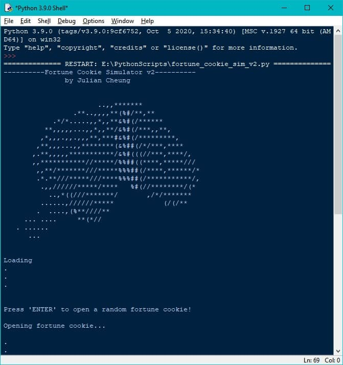

<div align="center">

# Fortune Cookie Simulator

**Crack open virtual fortune cookies in your terminal — ASCII art included.**


</div>

---



## What it does

A terminal-based fortune cookie simulator written in Python. Run the script, crack open a cookie, and get a random fortune drawn from a CSV file. You can swap in your own list of fortunes by pointing the script at any compatible `.csv` file — an example file (`nusas_custom_fortune_cookie.csv`) is included so you can get started immediately.

## Features

- ASCII art fortune cookie cracking animation in the terminal
- Reads fortunes from a user-supplied `.csv` file
- Example fortune list included and ready to use
- Simple interactive on-screen prompts — no setup beyond Python 3

## Tech Stack

| Layer | Choice |
|---|---|
| Script | Python 3 |

## Quick Start

```bash
git clone https://github.com/TheBooleanJulian/fortune-cookie-simulator.git
cd fortune-cookie-simulator
# Edit line 6 of fortune_cookie_sim_v2.py to point at your CSV file
python fortune_cookie_sim_v2.py
```

**Prerequisites:** Python 3 installed. No third-party packages required.

**Using your own fortunes:** Replace `nusas_custom_fortune_cookie.csv` with any CSV containing your list of fortunes, then update the filepath on line 6 of the script.

## Status / Roadmap

- [x] ASCII fortune cookie simulator working
- [x] Custom CSV fortune list support
- [ ] CLI argument for CSV path (remove hardcoded filepath)
- [ ] Package as a runnable CLI tool

## Changelog

- **Jan 2021** — Initial release: ASCII fortune cookie simulator with CSV-driven fortune list and interactive terminal prompts; screenshots added to repo

## License

MIT

---

<div align="center">
<sub>Built by <a href="https://github.com/TheBooleanJulian">@TheBooleanJulian</a></sub>
</div>